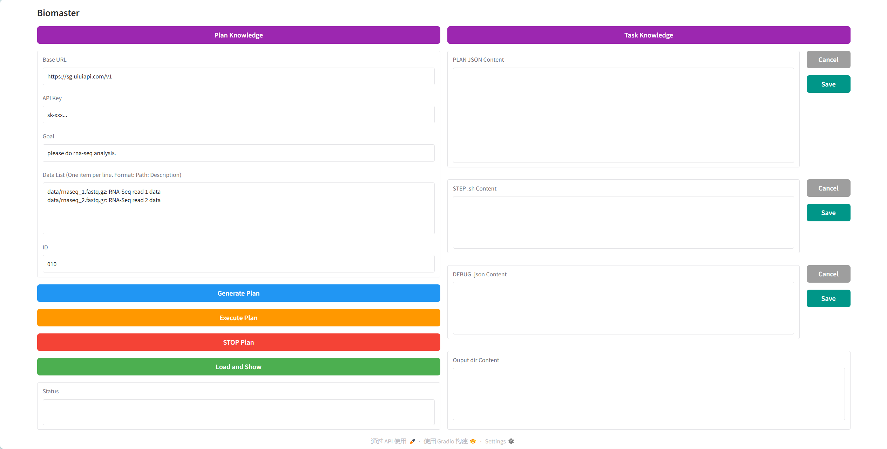

<div  align="center">    
 
</div>

# 🧬 BioMaster: Multi-agent System for Automated Bioinformatics Analysis Workflow

[](https://www.biorxiv.org/content/10.1101/2025.01.23.634608v1.abstract)

**BioMaster** is a sophisticated, multi-agent framework that leverages large language models (LLMs) and dynamic knowledge retrieval to automate and streamline complex bioinformatics workflows. Designed specifically to tackle the challenges of modern bioinformatics, BioMaster improves accuracy, efficiency, reproducibility, and scalability across diverse omics data types, including RNA-seq, ChIP-seq, single-cell analysis, spatial transcriptomics, and Hi-C data processing.

---

## 🚀 Key Features

- **✨ Fully Automated Bioinformatics Pipelines**
  - Seamlessly automates data preprocessing, alignment, variant calling, and comprehensive downstream analysis.

- **🤖 Role-Based Multi-Agent System**
  - Specialized agents (Plan, Task, Debug, and Check Agents) collaboratively handle task decomposition, execution, validation, and error recovery.

- **📚 Dynamic Retrieval-Augmented Generation (RAG)**
  - Dynamically retrieves and integrates domain-specific knowledge, allowing BioMaster to adapt rapidly to emerging bioinformatics tools and specialized workflows.

- **🔍 Advanced Error Handling & Recovery**
  - Robust error detection and automated debugging mechanisms minimize propagation of errors across workflow steps, ensuring reliability and reproducibility.

- **🧠 Optimized Memory Management**
  - Efficiently manages memory, enabling stable and consistent performance even in complex, long-running workflows.

- **⚙️ Extensible & Customizable**
  - Supports easy integration of custom bioinformatics tools, scripts, and workflows, empowering researchers to extend BioMaster according to their specific analysis needs.

- **🖥️ Interactive UI**
  - User-friendly graphical interface allows users without extensive computational expertise to effortlessly manage, execute, and monitor bioinformatics workflows.

---
## 📌 Supported Bioinformatics Workflows

BioMaster autonomously handles a diverse range of bioinformatics analyses across multiple omics modalities:

### 🧬 **RNA-seq Analysis**
- DEG analysis (Differentially Expressed Genes)
- DEG analysis (WGS-based)
- Fusion gene detection
- APA analysis (Alternative Polyadenylation)
- RNA editing
- Splicing analysis
- Expression quantification
- Novel transcript identification
- Functional enrichment
- Circular RNA identification

### 🔬 **ChIP-seq Analysis**
- Peak calling
- Motif discovery
- Functional enrichment

### 🧫 **Single-cell RNA-seq (scRNA-seq)**
- DEG analysis
- Marker gene identification
- Cell clustering
- Top marker genes identification

### 🗺️ **Spatial Transcriptomics**
- Neighborhood enrichment
- Cell type annotation
- Spatially Variable Gene (SVG) detection
- Clustering
- Ligand-Receptor interactions

### 🧩 **Hi-C Data Processing**
- Mapping & sorting conversion
- Pair parsing & cleaning
- Contact matrix generation

### 🧪 **Nanopore Sequencing**
- DNA methylation identification
- De novo assembly
- Alignment
- Quality control
- Host removal
- Transcript quantification analysis
- Isoform quantification (RNA-seq)

### 📌 **microRNA Analysis**
- microRNA prediction
- microRNA quantification

### 📂 **Other Specialized Data Types**
- DNA methylation (Bisulfite-Seq)
- DNase-seq hypersensitive site identification
- PAS (Polyadenylation Site) identification (3’end-seq)
- Protein-RNA cross-links identification
- Ribo-seq analysis (RBP-bound enriched genes)
- Metagenomic analysis and composition plotting
- TSS identification (CAGE-seq)
- Protein expression quantification
- Isoform quantification for PacBio RNA-seq
- Translated ORFs identification (Ribo-seq)

---
## 📖 Documentation

You can find the read the doc documentation in the [docs](https://biomaster.readthedocs.io/en/latest/) folder.

## 📖 Installation

You can install BioMaster using the following steps:

1. Clone the repository:

```sh
git clone https://github.com/yourusername/BioMaster.git
cd BioMaster
```

2. Install the required dependencies:

```sh
conda create -n agent python=3.12
# you can install other version of python,suggest use 3.10-3.12

conda activate agent

pip install -r requirements.txt
```


3. download data and move to `data/`:

google drive link: 
```sh
https://drive.google.com/drive/folders/1vA3WIAVXVo4RZSqXKsItEZHVaBgIIv_E?usp=sharing
```

---

PS: liunx has been tested to install directly, but windwos or mac have not been tested, so there is no way to determine if there might be a problem.

## Usage

### RAG Update

Biomaster uses two types of Retrieval-Augmented Generation (RAG) systems:
- **PLAN RAG**: Used during the planning phase.
- **EXECUTE RAG**: Used during the execution phase.

---

### PLAN RAG

If you want to add a **new analysis workflow**, you need to update the **PLAN RAG**.

#### Steps:

1. **Collect the analysis workflow**, e.g.:
   [ChIP-seq data analysis](https://nf-co.re/chipseq/2.1.0/)

2. **Write the workflow** based on the following format:

   - You can use LLMs (e.g., ChatGPT) to help you draft the workflow content.
   - If new scripts, tools, or functions are required, they can also be referenced in PLAN RAG.
   - PLAN RAG focuses on the **steps**, **required input**, and **expected output**, not detailed usage.
   - When describing input/output, it's strongly recommended to mention **data formats**, especially if the workflow is custom, uncommon, or newly developed. For example:
     ```
     Input Required: sample1.fastq.gz, sample2.fastq.gz  
     Expected Output: sample.sam
     ```

#### Example:

```
Fully ChIP-seq Peak Calling with IgG Control Workflow:  

Step 1: Quality Control – Conduct quality checks on raw sequencing data to assess data quality.  
Input Required: Raw FASTQ files.  
Expected Output: Cleaned and quality-checked FASTQ files.  
Tools Used: FastQC, Trimmomatic, Cutadapt.  

Step 2: Alignment – Align reads to the reference genome.  
Input Required: Cleaned FASTQ files and the reference genome.  
Expected Output: Sorted BAM file.  
Tools Used: BWA-MEM, Bowtie2, STAR.  

Step 3: SAM/BAM Conversion & Processing – Convert SAM to BAM, sort, and remove PCR duplicates.  
Input Required: SAM file.  
Expected Output: De-duplicated BAM file.  
Tools Used: SAMtools, Picard.  

Step 4: Signal Track Generation – Generate BigWig files for visualization.  
Input Required: De-duplicated BAM file.  
Expected Output: BigWig signal track file.  
Tools Used: deeptools, bedGraphToBigWig.  

Step 5: Peak Calling – Identify enriched genomic regions using IgG as a control.  
Input Required: De-duplicated BAM file and IgG control BAM file.  
Expected Output: NarrowPeak file.  
Tools Used: MACS3
```

3. **Add to PLAN RAG**:
   - Edit `./doc/Plan_Knowledge.json`
   - Use the following JSON format:
     ```json
     {
       "content": "Fully ChIP-seq Peak Calling with IgG Control Workflow: Step 1: Quality Control – Conduct quality checks on raw sequencing data to assess data quality. Input Required: Raw FASTQ files. Expected Output: Cleaned and quality-checked FASTQ files. Tools Used: FastQC, Trimmomatic, Cutadapt. Step 2: Alignment – Align reads to the reference genome. Input Required: Cleaned FASTQ files and the reference genome. Expected Output: Sorted BAM file. Tools Used: BWA-MEM, Bowtie2, STAR. Step 3: SAM/BAM Conversion & Processing – Convert SAM to BAM, sort, and remove PCR duplicates. Input Required: SAM file. Expected Output: De-duplicated BAM file. Tools Used: SAMtools, Picard. Step 4: Signal Track Generation – Generate BigWig files for visualization. Input Required: De-duplicated BAM file. Expected Output: BigWig signal track file. Tools Used: deeptools, bedGraphToBigWig. Step 5: Peak Calling – Identify enriched genomic regions using IgG as a control. Input Required: De-duplicated BAM file and IgG control BAM file. Expected Output: NarrowPeak file. Tools Used: MACS3.",
       "metadata": {
         "source": "workflow",
         "page": 16
       }
     }
     ```
#### EXECUTE RAG

1. **Collect the tools, scripts, functions, etc.**
   - **Scripts**: It is recommended to store all scripts in `./scripts/`.
   - **Tools**: If a tool is newly introduced, please install it in advance and ensure it's accessible.
   - **Functions**: Suggest placing them in `./scripts/functions.py`.

2. **Document the usage of these tools, scripts, and functions**
   - Focus on organizing usage examples, such as:
     ```bash
     samtools view -S -b ./output/001/aligned_reads.sam > ./output/001/aligned_reads.bam
     ```
     Provide example commands and parameter explanations. The more detailed, the better.
   - If a tool is already installed and difficult to set up, note in the knowledge base that no additional installation is required.
   - If it's a script or function, specify where it is stored and how to call it. For instance, to use `run-cooler.sh` in a Hi-C task, write:
     ```bash
     bash ./scripts/run-cooler.sh ...
     ```
   - You can use an LLM to help you write and organize content for the EXECUTE RAG.

3. **Knowledge entry recommendations**
   - Add the tool name in the `source` field to help the PLAN AGENT locate the correct tool.
   - If a script or function is specific to one workflow, append a note like: `run-sort-bam.sh only used in hic workflow`.

4. **Add entries to the EXECUTE RAG in `./doc/Task_Knowledge.json`**
   - Example format:
```json
 {
        "content": "2. run-sort-bam.sh:\nData-type-independent, generic bam sorting module\nInput : any unsorted bam file (.bam)\nOutput : a bam file sorted by coordinate (.sorted.bam) and its index (.sorted.bam.bai).\nUsage\nRun the following in the container.\nrun-sort-bam.sh <input_bam> <output_prefix>\n# input_bam : any bam file to be sorted\n# output_prefix : prefix of the output bam file.\n\nSet parameters according to the example: Suppose the input file is: ./output/GM12878_bwa_1.bam and ./output/GM12878_bwa_2.bam, the target is./output/GM12878_bwa_sorted.bam and ./output/GM12878_bwa_sorted, Generate the following sample script:\nbash ./scripts/run-sort-bam.sh ./output/GM12878_bwa_1.bam ./output/GM12878_bwa_sorted \n\nbash ./scripts/run-sort-bam.sh ./output/GM12878_bwa_2.bam ./output/GM12878_bwa_sorted\n\nYou can install the tool, but do not do any additional operations.You can install the tool, but do not do any additional operations.Please follow the example to generate rather than copy and paste completely, especially for folder names, file names, etc.",
        "metadata": {
            "source": "run-sort-bam.sh",
            "page": 6
        }
    },
```
Notes:

- To delete or update existing knowledge, please modify the corresponding entries in 
  `./doc/Task_Knowledge.json` and `./doc/Plan_Knowledge.json`. After that, delete the 
  `./chroma_db` folder, which stores the embedding vector database of the current knowledge.
  
- If you notice that certain knowledge is not being utilized in the PLAN or EXECUTE phase, 
  consider refining or expanding the knowledge or goals. You can achieve this by either:
  - Adding relevant information to the knowledge files, or
  - Making the task goal more specific.

- Do not use all available knowledge by default. It’s recommended to selectively use only the 
  knowledge relevant to your task to ensure efficiency and relevance.

- Keep the knowledge concise and high quality. Biomaster is designed to handle most tasks 
  out-of-the-box, and does not require additional installation steps 
  (e.g., installing R packages via `sudo`).

### Use Biomaster in Terminal

#### How to Run the Example

The example code is located in the `./examples/` folder.

1. **Add your API key and base URL**  
   - Open `run.py` or `examples/file.py` and insert your OpenAI API key and base URL.

2. **Move the example script**  
   - Move `examples/file.py` into the root directory of Biomaster:
     ```bash
     mv examples/file.py ./BioMaster/
     ```

3. **Download the data**  
   - Download the required dataset using the Google Drive link provided in `README.md`, and place the data in the `./data/` directory.

4. **Set the task ID**  
   - In `run.py` or `file.py`, set a unique `id` for your task.  
     - This `id` can be any string, but **must not be duplicated**.

5. **Run the example**  
   - Use the following command to execute:
     ```bash
     conda activate agent
     python run.py
     ```
     or
     ```bash
     conda activate agent
     python example1.py
     ```

```python
from agents.Biomaster import Biomaster
from langchain_core.messages import HumanMessage
import json
# Example of using the agent
if __name__ == "__main__":

    config = {"configurable": {"thread_id": "abc124"}}
    api_key = ''
    base_url = ''
    # you can choose other base url
    manager = Biomaster(api_key, base_url,excutor=True,id='001')
    

    datalist=[ './data/rnaseq_1.fastq.gz: RNA-Seq read 1 data (left read)',
            './data/rnaseq_2.fastq.gz: RNA-Seq read 2 data (right read)',
            './data/minigenome.fa: small genome sequence consisting of ~750 genes.',]
    goal='please do WGS/WES data analysis Somatic SNV+indel calling.'
    manager.execute_PLAN(goal,datalist)
    print("**********************************************************")

    PLAN_results_dict = manager.execute_TASK(datalist)
    print(PLAN_results_dict)
```
#### How to Read the Output

Biomaster stores all output files in the `./output/` directory.

- `./output/{id}_PLAN.json`  
  Contains the full execution plan. Biomaster will follow this step-by-step.

- `./output/{id}_Step_{step_number}.sh`  
  The shell script generated for a specific step.  
  Example: `001_Step_1.sh` is the script for the first step of task `id="001"`.

- `./output/{id}_DEBUG_Input_{step_number}.json`  
  Internal input for script execution. Can usually be ignored.

- `./output/{id}_DEBUG_Output_{step_number}.json`  
  Contains execution output and status for a specific step:
  - `"shell"`: If the step succeeded, this is usually empty.  
    If the step failed, this contains a new shell command generated by the Debug Agent to fix the issue.
  - `"analyze"`: Analysis summary of the step’s output.
  - `"output_filename"`: Name of the output file produced in this step.
  - `"stats"`: Indicates whether the step succeeded (`true`) or failed (`false`).  
    If `false`, the Debug Agent will attempt to fix the error and regenerate the command.

- `./output/{id}/`  
  All generated output files for this task will be stored in this folder.

---

#### How to Modify the Plan

1. **Stop the running task**.

2. Comment out the following line in `run.py`:
   ```python
   # manager.execute_PLAN(goal, datalist)
   ```
   This will prevent Biomaster from generating a new plan.

3. Manually edit the plan in:
   ```text
   ./output/{id}_PLAN.json
   ```

4. Run the script again:
   ```bash
   python run.py
   ```

---

#### How to Modify the Execute Script

1. **Stop the running task**.

2. If you want to **roll back previous steps (Step 1–N)**:
   - Either set `"stats": false` in the corresponding `DEBUG_Output` file:
     ```
     ./output/{id}_DEBUG_Output_{step_number}.json
     ```
   - Or simply delete the `DEBUG_Output` file to re-trigger execution.

3. If you want to **modify the current step**:
   - Edit the corresponding shell script:
     ```text
     ./output/{id}_Step_{step_number}.sh
     ```
   - **Do not delete** the related `DEBUG_Output` JSON file — Biomaster will reuse it and execute the updated script.

4. Run the script again:
   ```bash
   python run.py
   ```

### Use Biomaster in UI Mode

#### 1. Start the UI

Run the following command to launch the Biomaster UI:

```bash
conda activate agent
python runv.py
```

#### 2. Open the UI in your browser

Once started, open the following URL in your browser:

```text
http://127.0.0.1:7860/
```

The UI interface looks like this:



---

#### 3. Add Knowledge to PLAN RAG and EXECUTE RAG  
Make sure your analysis workflows and tools are already added to the corresponding RAGs.

---

#### 4. Configure API Access  
Set your **Base URL** and **API Key** in the designated fields in the UI.

---

#### 5. Define the Task  
Provide the following inputs:
- **Task ID**: A unique identifier for this task.
- **Input Data Path**: Path to your data.
- **Goal**: A description of the analysis you want Biomaster to perform.

---

#### 6. Generate the Plan  
Click the **"Generate Plan"** button to allow Biomaster to generate a task execution plan.

---

#### 7. Execute the Plan  
After the plan is ready, click the **"Execute Plan"** button to start the automated execution process.

---

#### 8. Stop the Task  
If you need to interrupt execution, click the **"Stop PLAN"** button.

---

#### 9. Load and View Results  
Click the **"Load and Show"** button to:
- Load and review results of a previous task, or
- Display outputs from the current task.


## 📚 File Structure

- `agents/`: Contains agent classes for task management and execution.
- `scripts/`: some example scripts.
- `output/`: Output directory where results and logs are saved.
- `doc/`: Stores documentation files for the workflows.
- `data/`: Usually used to store files.

---
##  📧 Citation
if you use BioMaster in your work, please cite the following paper:

```bibtex
@article{su2025biomaster,
  title={BioMaster: Multi-agent System for Automated Bioinformatics Analysis Workflow},
  author={Su, Houcheng and Long, Weicai and Zhang, Yanlin},
  journal={bioRxiv},
  pages={2025--01},
  year={2025},
  publisher={Cold Spring Harbor Laboratory}
}
```

You can also join Biomaster community:

1. Discord:

[Discord](https://discord.gg/WYVyRAA6yn)

2. wechat:

<div  align="center">    
 
</div>

## License

This project is licensed under the following terms:

- **Code**: Licensed under the MIT License. See LICENSE for details.
- **Data and Documentation**: Licensed under the Creative Commons Attribution-NonCommercial 4.0 International (CC BY-NC 4.0).

---

## Acknowledgments

- This project uses the [langchain](https://github.com/hwchase17/langchain) library for integration with OpenAI and other tools.
- Thanks to all contributors and the open-source community for making BioMaster possible!
